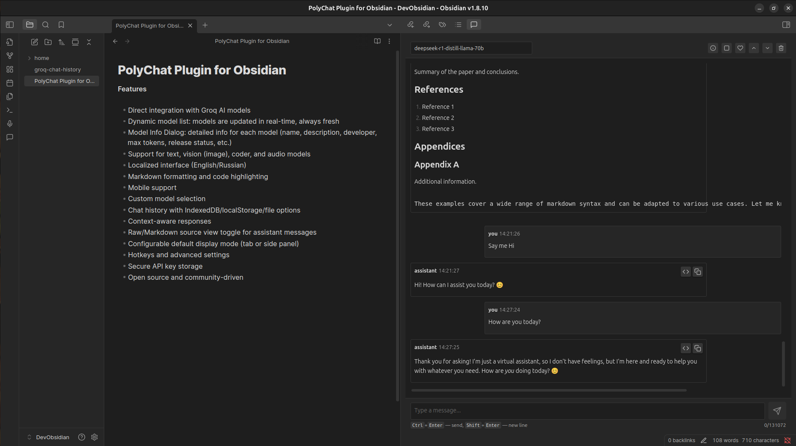
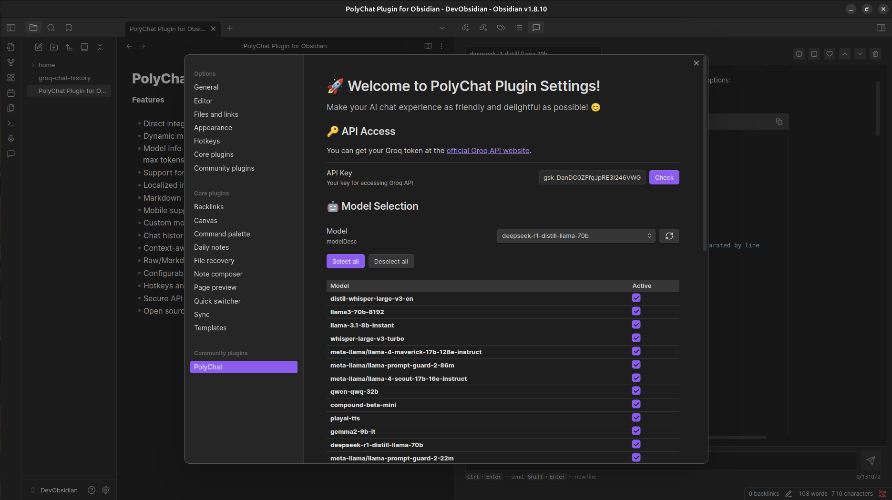

# PolyChat – Obsidian Plugin

[](https://github.com/semernyakov/polychat/releases/latest)
[](https://github.com/semernyakov/polychat/releases)
[](LICENSE)
[](https://github.com/semernyakov/polychat/actions/workflows/ci.yml)
[](https://www.npmjs.com/package/groq-poly-chat)
[](CODE_OF_CONDUCT.md)

<!-- [](https://codecov.io/gh/semernyakov/groq-chat-plugin) -->

[Русская версия](docs/README.ru.md)

A plugin for Obsidian that integrates Groq AI capabilities directly into your notes.

PolyChat is a powerful chat extension with support for AI models via the Groq API. Designed for flexibility and ease of use, it enables seamless communication with multiple models directly from your vault.

## Screenshots

**Main Interface**



**Settings Interface**



## Features

| Category                | Features                                                                                                                                                                                                      |
| ----------------------- | ------------------------------------------------------------------------------------------------------------------------------------------------------------------------------------------------------------- |
| **🤖 AI Integration**   | Direct integration with Groq AI models<br>Dynamic model list: models are updated in real-time<br>Model Info Dialog: detailed info for each model<br>Support for text, vision (image), coder, and audio models |
| **🌐 Localization**     | Localized interface (English/Russian)<br>Automatically detects Obsidian language                                                                                                                              |
| **📝 Content**          | Markdown formatting and code highlighting<br>Raw/Markdown source view toggle<br>Context-aware responses<br>Create new notes from AI messages                                                                  |
| **📱 Platform**         | Mobile support<br>Configurable default display mode (tab or side panel)                                                                                                                                       |
| **⚙️ Model Management** | Custom model selection with grouping by model owner<br>Batch model activation/deactivation<br>Temperature and max tokens configuration                                                                        |
| **💾 Storage**          | Chat history with multiple storage options:<br>• In-memory storage<br>• localStorage<br>• IndexedDB<br>• File-based storage<br>Configurable history length and loading behavior                               |
| **🔐 Security**         | Secure API key storage<br>Hotkeys and advanced settings                                                                                                                                                       |
| **💝 Community**        | Support dialog with donation links<br>Open source and community-driven                                                                                                                                        |

## Project Status

This project is actively maintained and developed. New features are added regularly, including dynamic model updates, vision/coder/audio support, and improved UI/UX. Automated tests and advanced model integrations (audio/image) are planned. Feedback and contributions are welcome!

### Supported Models (Grouped by Developer)

| Developer           | Models                                                                                                                                    | Purpose                                                                                         |
| ------------------- | ----------------------------------------------------------------------------------------------------------------------------------------- | ----------------------------------------------------------------------------------------------- |
| **Meta**            | Llama 4 Scout 17B 16E Instruct<br>Llama Prompt Guard 2 22M<br>Llama Prompt Guard 2 86M<br>Llama 3.3 70B Versatile<br>Llama 3.1 8B Instant | Text Generation<br>Content Filtering<br>Content Filtering<br>General Purpose<br>General Purpose |
| **OpenAI**          | Whisper Large v3 Turbo<br>Community OSS Model (20B)<br>Whisper Large v3<br>Community OSS Model (120B)                                     | Speech-to-Text<br>General Purpose<br>Speech-to-Text<br>General Purpose                          |
| **Moonshot AI**     | Kimi K2 Instruct<br>Kimi K2 Instruct (0905)                                                                                               | General Purpose                                                                                 |
| **Alibaba Cloud**   | Qwen3 32B                                                                                                                                 | General Purpose                                                                                 |
| **SDAIA**           | Allam 2 7B                                                                                                                                | Text Generation (Arabic)                                                                        |
| **Groq**            | Groq Compound<br>Groq Compound Mini                                                                                                       | General Purpose                                                                                 |
| **Canopy Labs**     | canopylabs/orpheus Arabic saudi<br>canopylabs/orpheus v1 english                                                                          | Text-to-Speech (Arabic)<br>Text-to-Speech (English)                                             |
| **OpenAI (Safety)** | OpenAI/gpt oss safeguard 20b<br>OpenAI/gpt oss 120b                                                                                       | Content Safety<br>General Purpose                                                               |

> _Last updated: March 26, 2026_ <br>
> See plugin settings for the full up-to-date list. Descriptions will be updated as soon as they become available.

## Installation

1. Open Obsidian Settings
2. Go to Community Plugins and disable Safe Mode
3. Click Browse and search for "PolyChat"
4. Install the plugin
5. Enable the plugin in Community Plugins

## Configuration

1. Get your API key from [Groq Console](https://console.groq.com)
2. Open plugin settings in Obsidian
3. Enter your API key
4. Configure additional settings as needed (Note: Settings have been updated, including options for default display mode and history storage. See plugin settings for details.)

## Usage

1. Open any note in Obsidian
2. Click the PolyChat icon in the sidebar
3. Select the model you want (models update in real time)
4. Start chatting with AI (text, code)
5. View model info any time via the Model Info Dialog

## Test the Plugin with BRAT

You can install and test the latest development version of the plugin using the [BRAT](https://github.com/TfTHacker/obsidian42-brat) (Beta Reviewers Auto-update Tool) plugin for Obsidian.

**Steps**

1. Install BRAT from the Obsidian Community Plugins.
2. Open BRAT settings.
3. Click Add Beta Plugin.
4. Paste the repository URL: https://github.com/semernyakov/polychat
5. Confirm installation.

BRAT will automatically install the plugin and allow you to receive updates directly from the repository.

## Development

```bash
# Clone the repository
git clone https://github.com/semernyakov/polychat.git

# Install dependencies
npm install

# Development mode
npm run dev

# Build the plugin
npm run build

# Formatting
npm run format

# Lint the code
npm run lint
```

## Contributing

Contributions are welcome! Please read our [Contributing Guide](CONTRIBUTING.md) for details on our code of conduct and the process for submitting pull requests.

## Security

For security issues, please read our [Security Policy](SECURITY.md) and report any vulnerabilities responsibly.

> **🔐 Security Note:** Your Groq API key is stored only on your local device and is never transmitted to any server.
>
> **🛡️ Data Privacy:** This plugin does not collect, store, or transmit your API keys or chat data. All data remains on your local device.

## License

This project is licensed under the MIT License - see the [LICENSE](LICENSE.md) file for details.

## Support

If you find PolyChat helpful, you can support development via:

- 💰 **YooMoney**: [Support via YooMoney](https://yoomoney.ru/fundraise/194GT5A5R07.250321)
  - Accepts transfers from both Russia and other Countries (via bank cards)
- ⭐ **Star the repository**: [Add a star on GitHub](https://github.com/semernyakov/polychat)
- 🐛 **Report issues**: [Create an issue](https://github.com/semernyakov/polychat/issues)

## Changelog

See [CHANGELOG.md](CHANGELOG.md) for all changes.

---
