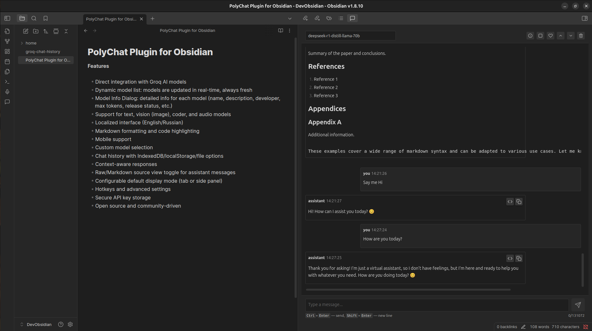
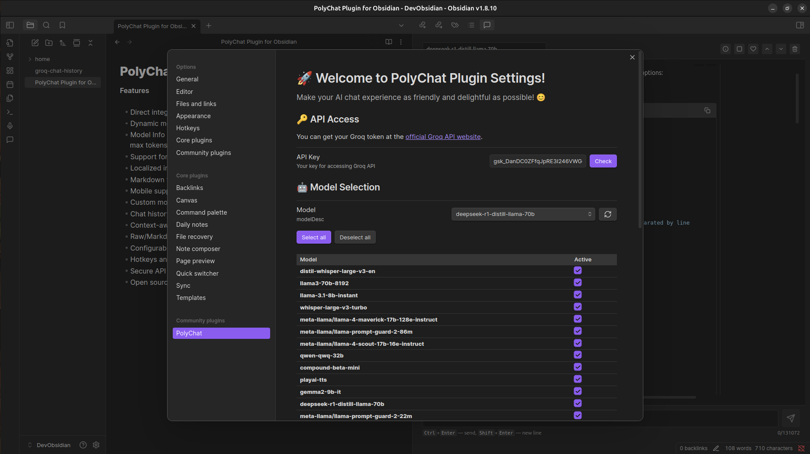

# PolyChat — Плагин для Obsidian

[](https://github.com/semernyakov/polychat/releases/latest)
[](https://github.com/semernyakov/polychat/releases)
[](LICENSE)
[](https://github.com/semernyakov/polychat/actions/workflows/ci.yml)
[](https://www.npmjs.com/package/groq-poly-chat)
[](CODE_OF_CONDUCT.md)

<!-- [](https://codecov.io/gh/semernyakov/groq-chat-plugin) -->

[English version](../README.md)

Плагин для **Obsidian**, который интегрирует **Groq AI** прямо в ваши заметки. Позволяет общаться с разными AI‑моделями, хранить историю, использовать Markdown и управлять параметрами работы моделей.

PolyChat — это мощное расширение чата с поддержкой моделей AI через API Groq. Разработано для гибкости и простоты использования, оно обеспечивает беспрепятственное общение с множеством моделей непосредственно из вашего хранилища.

## Скриншоты

**Основной интерфейс**



**Интерфейс настроек**



## Возможности

| Категория                  | Возможности                                                                                                                                                                                                                                                                        |
| -------------------------- | ---------------------------------------------------------------------------------------------------------------------------------------------------------------------------------------------------------------------------------------------------------------------------------- |
| **🤖 AI Интеграция**       | Прямая интеграция с моделями Groq AI<br>Динамический список моделей: модели обновляются в реальном времени<br>Кнопка обновления списка моделей<br>Диалоговое окно модели: подробная информация о каждой модели<br>Поддержка текстовых, vision (изображения), coder и audio моделей |
| **🌐 Локализация**         | Локализация интерфейса (русский/английский)<br>Автоматически определяет язык Obsidian                                                                                                                                                                                              |
| **📝 Контент**             | Поддержка форматирования Markdown и подсветка кода<br>Переключатель просмотра Raw/Markdown<br>Контекстно-зависимые ответы<br>Создание новых заметок из сообщений AI                                                                                                                |
| **📱 Платформа**           | Поддержка мобильных устройств<br>Настраиваемый режим отображения по умолчанию (вкладка или боковая панель)                                                                                                                                                                         |
| **⚙️ Управление моделями** | Выбор пользовательских моделей с группировкой по владельцам<br>Массовая активация/деактивация моделей<br>Настройка температуры и максимального количества токенов                                                                                                                  |
| **💾 Хранение**            | История чата с несколькими вариантами хранения:<br>• Хранение в памяти<br>• localStorage<br>• IndexedDB<br>• Хранение в файле<br>Настраиваемая длина истории и поведение загрузки                                                                                                  |
| **🔐 Безопасность**        | Безопасное хранение API ключа<br>Горячие клавиши и расширенные настройки                                                                                                                                                                                                           |
| **💝 Сообщество**          | Диалог поддержки со ссылками на донаты<br>Открытый исходный код и поддержка сообщества                                                                                                                                                                                             |

## Статус проекта

Этот проект активно поддерживается и развивается. Новые функции добавляются регулярно, включая динамические обновления моделей, поддержку vision/coder/audio и улучшенный UI/UX. Планируется автоматизированное тестирование и расширенные интеграции моделей (аудио/изображения). Обратная связь и вклад приветствуются!

## 🤖 Поддержка моделей (Группировка по разработчикам)

| Разработчик         | Модели                                                                                                                                                                                               |
| ------------------- | ---------------------------------------------------------------------------------------------------------------------------------------------------------------------------------------------------- |
| **SDAIA**           | Allam 2 7B                                                                                                                                                                                           |
| **DeepSeek / Meta** | DeepSeek-R1-Distill-Llama-70B                                                                                                                                                                        |
| **Google**          | Gemma 2 9B Instruct                                                                                                                                                                                  |
| **Groq**            | Groq Compound<br>Groq Compound Mini                                                                                                                                                                  |
| **Meta**            | Llama 3.1 8B Instant<br>Llama 3.3 70B Versatile<br>Llama 4 Maverick 17B 128E Instruct<br>Llama 4 Scout 17B 16E Instruct<br>Llama Guard 4 12B<br>Llama Prompt Guard 2 22M<br>Llama Prompt Guard 2 86M |
| **Moonshot AI**     | Kimi K2 Instruct<br>Kimi K2 Instruct (0905)                                                                                                                                                          |
| **PlayAI**          | PlayAI TTS<br>PlayAI TTS (Arabic)                                                                                                                                                                    |
| **Alibaba Cloud**   | Qwen3 32B                                                                                                                                                                                            |
| **OpenAI**          | Поддержка моделей Whisper (от OpenAI):<br>• Whisper Large v3<br>• Whisper Large v3 Turbo                                                                                                             |

> Полный и актуальный список всегда отображается в настройках плагина. Описания будут добавлены по мере появления.

## Установка

1. Откройте настройки Obsidian
2. Перейдите в раздел Community Plugins и отключите безопасный режим
3. Нажмите "Обзор" и найдите "PolyChat"
4. Установите плагин
5. Включите плагин в разделе Community Plugins

## Настройка

1. Получите API ключ на [Groq Console](https://console.groq.com)
2. Откройте настройки плагина в Obsidian
3. Введите ваш API ключ
4. Настройте дополнительные параметры по необходимости (Примечание: Настройки были обновлены, включая опции для режима отображения по умолчанию и хранения истории. Подробности см. в настройках плагина.)

## Использование

1. Откройте любую заметку
2. Нажмите на иконку PolyChat в боковой панели
3. Начните общение с AI
4. Используйте команды с `/` для дополнительных функций **(не реализовано!)**

## Разработка

```bash
# Клонировать репозиторий
git clone https://github.com/semernyakov/polychat.git

# Установить зависимости
npm install

# Собрать плагин
npm run build

# Проверить стиль кода
npm run lint
```

<!-- # Проверка устаревших моделей

Скрипт `check_obsolete_models.ts` проверяет, не использует ли плагин устаревшие модели Groq и помогает поддерживать совместимость с последними доступными моделями.

## Как использовать

### Быстрый старт (рекомендуемый способ)

# Показать справку и доступные опции
npm run check-models -- --help

# Проверить модели в стандартном расположении
npm run check-models

# Проверить с указанием пути к настройкам плагина (Linux/macOS)
npm run check-models -- --plugin-data-dir=~/.config/obsidian/plugins/groq-chat-plugin/data

# Проверить с указанием пути к настройкам плагина (Windows)
npm run check-models -- --plugin-data-dir=%APPDATA%\\obsidian\\plugins\\groq-chat-plugin\\data

# Вывести список всех доступных моделей (включая устаревшие)
npm run check-models -- --list-all

# Запустить с выводом на английском языке
npm run check-models -- --lang=en


### Дополнительные опции

1. **Указать каталог настроек Obsidian** (если известен путь к `.obsidian`):

   ```bash
   # Относительный путь (рекомендуется)
   npm run check-models -- --config-dir=~/.obsidian

   # Абсолютный путь
   npm run check-models -- --config-dir=/полный/путь/к/хранилищу/.obsidian
   ```

2. **Использовать переменные окружения** (полезно для скриптов):

   ```bash
   OBSIDIAN_VAULT_PATH=~/.config/obsidian \
   npm run check-models
   ```

3. **Режим разработки** (использует пути по умолчанию):
   ```bash
   NODE_ENV=development npm run check-models
   ```

### Где найти настройки плагина?

Настройки плагина обычно находятся в одном из этих мест:

- **Linux**: `~/.config/obsidian/plugins/groq-chat-plugin/data/settings.json`
- **Windows**: `%APPDATA%\\obsidian\\plugins\\groq-chat-plugin\\data\\settings.json`
- **macOS**: `~/Library/Application Support/obsidian/plugins/groq-chat-plugin/data/settings.json`

### Что делает скрипт?

1. Находит файл настроек плагина
2. Проверяет, какие модели указаны в настройках
3. Сравнивает их с актуальным списком моделей Groq
4. Определяет устаревшие модели, которые следует заменить
5. Обнаруживает неизвестные модели, которых нет в официальном списке
6. Предоставляет рекомендации по замене моделей, когда это возможно
-->

## Участие в разработке

Мы приветствуем ваше участие! Пожалуйста, прочтите наше [Руководство по участию](./CONTRIBUTING.ru.md) для получения информации о кодексе поведения и процессе отправки pull request'ов.

## Безопасность

> **🔐 Примечание безопасности:** Ваш API ключ Groq хранится только на вашем локальном устройстве и никогда не передается на какой-либо сервер.
>
> **🛡️ Конфиденциальность данных:** Этот плагин не собирает, не хранит и не передает ваши API ключи или данные чата. Все данные остаются на вашем локальном устройстве.

По вопросам безопасности, пожалуйста, ознакомьтесь с нашей [Политикой безопасности](./SECURITY.ru.md) и сообщайте об уязвимостях ответственно.

## Лицензия

Этот проект лицензирован под MIT License - см. файл [LICENSE](../LICENSE.md) для подробностей.

## Поддержка

Если вы находите этот плагин полезным, рассмотрите возможность:

- 💰 **YooMoney**: [Поддержать через YooMoney](https://yoomoney.ru/fundraise/194GT5A5R07.250321)
  - Принимает переводы как из России, так и из других стран (через банковские карты)
- ⭐ **Поставить звезду**: [Добавить звезду на GitHub](https://github.com/semernyakov/polychat)
- 🐛 **Сообщить о проблеме**: [Создать issue](https://github.com/semernyakov/polychat/issues)

## История изменений

См. [CHANGELOG.ru.md](./CHANGELOG.ru.md) для всех изменений.

---

Copyright (c) 2025 Ivan Semernyakov
